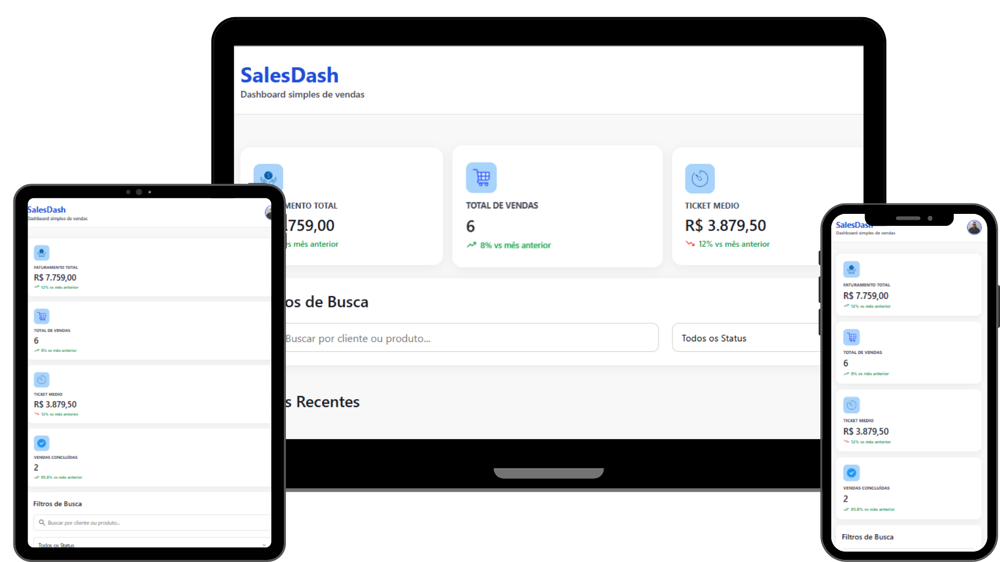

<h1 align="center">Sales Dash</h1>

<p align="center">
  Dashboard de vendas desenvolvido com HTML, CSS e JavaScript puro, com foco em manipulação de dados, renderização dinâmica e aplicação prática dos métodos map, filter e reduce.
</p>

<p align="center">
  <a href="#-about-the-project">Sobre o projeto</a>&nbsp;&nbsp;|&nbsp;&nbsp;
  <a href="#-features">Funcionalidades</a>&nbsp;&nbsp;|&nbsp;&nbsp;
  <a href="#-technologies">Tecnologias</a>&nbsp;&nbsp;|&nbsp;&nbsp;
  <a href="#-project-structure">Estrutura</a>&nbsp;&nbsp;|&nbsp;&nbsp;
  <a href="#-getting-started">Como executar</a>
</p>

<br>

<p align="center">
  
</p>

---

## 🏠 About the project

O **Sales Dash** é um dashboard de vendas desenvolvido com foco em lógica de programação e manipulação dinâmica de dados utilizando **JavaScript puro**.

A proposta do projeto foi transformar uma interface estática em uma aplicação funcional, onde os dados das vendas são armazenados em um array de objetos e utilizados para renderizar cards, aplicar filtros combinados e calcular métricas comerciais automaticamente.

O projeto foi construído para praticar conceitos essenciais do desenvolvimento front-end, especialmente o uso dos métodos de array **map**, **filter** e **reduce** em um cenário real de dashboard.

---

## 🧰 Features

- Renderização dinâmica de cards de vendas
- Base de dados local estruturada em array de objetos
- Filtro por status da venda
- Filtro por categoria
- Busca textual por cliente ou produto
- Combinação de múltiplos filtros em tempo real
- Atualização dinâmica da interface ao interagir com os filtros
- Cálculo automático de faturamento total
- Cálculo de total de vendas
- Cálculo de ticket médio
- Contagem de vendas concluídas
- Formatação monetária no padrão brasileiro
- Mensagem para quando nenhuma venda for encontrada
- Separação da lógica em funções reutilizáveis
- Interface responsiva e organizada para visualização de dados

---

## 💻 Technologies

Este projeto foi desenvolvido com as seguintes tecnologias:

- HTML5
- CSS3
- JavaScript
- DOM Manipulation
- Array Methods
  - map
  - filter
  - reduce
- Intl.NumberFormat
- Responsividade com CSS

---

## 👷 Project structure

A estrutura principal do dashboard está organizada em:

- Header do dashboard
- Cards de resumo
- Campo de busca
- Filtros por status e categoria
- Lista dinâmica de vendas
- Cards individuais de venda
- Lógica de renderização
- Lógica de filtros combinados
- Lógica de cálculo de métricas

---

## 🏗️ Logic and development decisions

O principal foco do projeto foi aplicar lógica de programação em uma interface visual de dashboard.

Alguns pontos importantes da implementação:

- Os dados das vendas foram centralizados em um array de objetos
- O método `map` foi utilizado para transformar os dados em elementos HTML
- O método `filter` foi utilizado para aplicar busca, status e categoria de forma combinada
- O método `reduce` foi utilizado para calcular métricas comerciais a partir da lista atual de vendas
- A função principal de atualização centraliza a renderização dos cards e o cálculo dos indicadores
- A interface responde automaticamente às interações do usuário
- Os valores monetários são exibidos em formato brasileiro usando `Intl.NumberFormat`

---

## 📊 Business rules

As métricas do dashboard seguem as seguintes regras:

- O faturamento total considera apenas vendas com status concluída
- O total de vendas considera todas as vendas da lista filtrada
- O ticket médio é calculado com base apenas nas vendas concluídas
- Vendas pendentes e canceladas não entram no faturamento
- Os cards de resumo são recalculados sempre que os filtros mudam

---

## 🔎 Filters behavior

O dashboard permite combinar os filtros de forma simultânea.

É possível filtrar por:

- Status
  - Todos
  - Concluída
  - Pendente
  - Cancelada

- Categoria
  - Todas
  - Eletrônicos
  - Serviços
  - Acessórios

- Busca textual
  - Nome do cliente
  - Nome do produto

Exemplo de uso:

Ao selecionar o status `Concluída`, a categoria `Eletrônicos` e buscar por `iPhone`, o dashboard exibe somente vendas que atendem a todas essas condições ao mesmo tempo.

---

## 🧠 Main learning points

Durante o desenvolvimento deste projeto, foram praticados conceitos importantes de JavaScript e front-end, como:

- Manipulação do DOM
- Criação de elementos dinâmicos
- Eventos de usuário
- Estruturação de dados com objetos
- Renderização baseada em dados
- Filtros combinados
- Cálculo de indicadores com reduce
- Organização de responsabilidades em funções
- Atualização dinâmica da interface

---

## 🔰 Getting Started

### Prerequisites

Antes de começar, você vai precisar ter instalado:

- Git
- Um navegador de sua preferência
- Um editor de código, como VS Code

---

### Clone the repository

```bash
git clone https://github.com/seu-usuario/sales-dash.git
